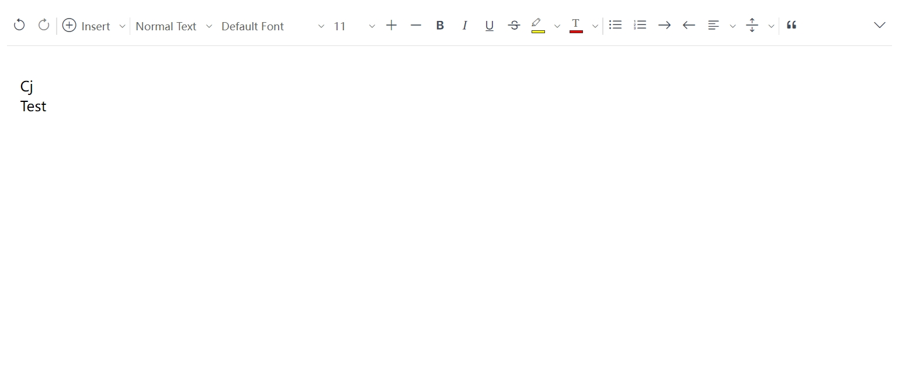

# SetupNutria

SetupNutria is a feature-rich rich text editor designed to provide a comprehensive set of tools for text formatting, inserting images, videos, and attachments. It offers collaborative editing and communication features, making it a versatile platform for various use cases.



## Installation

You can install it into an existing project using npm or load the CDN file.

```bash
$ npm install --save @nutria-doc/nutria-doc
```

```javascript
<script>
    Nutria.create("#editor")
</script>
```

## Features

### Working
- Fixing some issues


### Planned
- Table

### Finished
- Image, Video, Attachment, upload
- Toolbar, line toolbar, inline toolbar
- Link
- Code
- Collaboration

## Documentation

- [Getting Started](https://nutria-doc.github.io/nutria-doc/)
- [API](https://nutria-doc.github.io/nutria-doc/api/)

## Contributing

### Ideas

The development repository of nutria-doc can be found at https://github.com/nutriadoc/nutriadoc. This is the primary place for sharing opinions and making contributions. Providing feedback to the core team about the direction they are taking, whether it is positive or negative, is highly appreciated!

### Discussion

For reporting issues, please visit the nutria-doc repository https://github.com/nutriadoc/nutriadoc/issues

### Development

nutria-doc is developed based on quill.js. It does not rely on any UI framework, but it can be used with frameworks like React, Vue, Angular, and others.

## License

Licensed under the terms of the MIT License. For detailed information about the license, please refer to the [LICENSE](LICENSE) file 